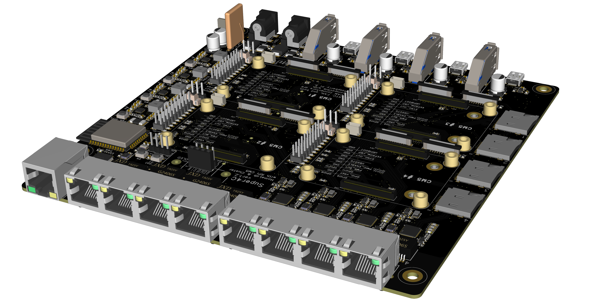

<h1>Super4C</h1> 
is a cluster-type platform built for the Raspberry Pi CM5. This hardware mini-ITX size, supports four CM5 channels and expands nearly all of the CM5's interfaces. It also integrates an ESP32 processing module, enabling remote management capabilities for the entire cluster device.

